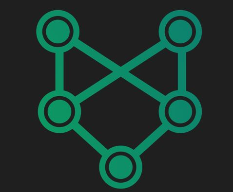
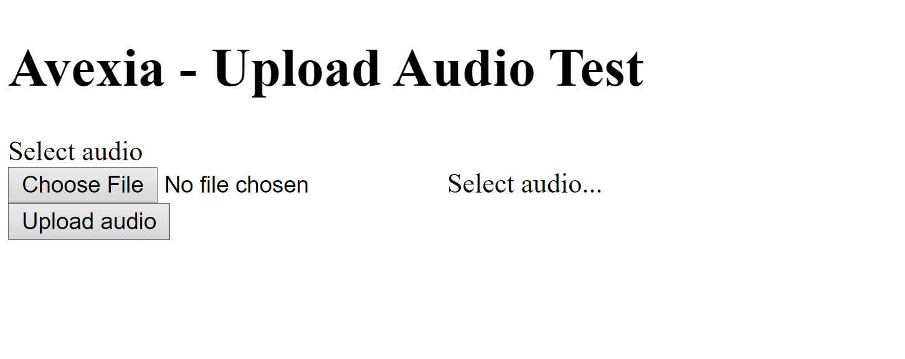
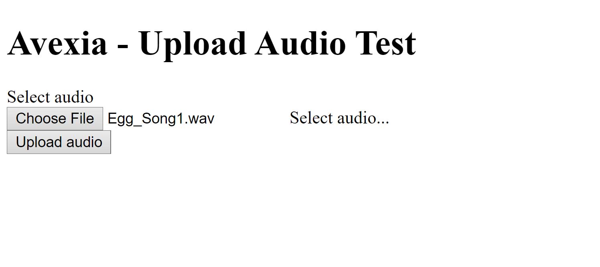
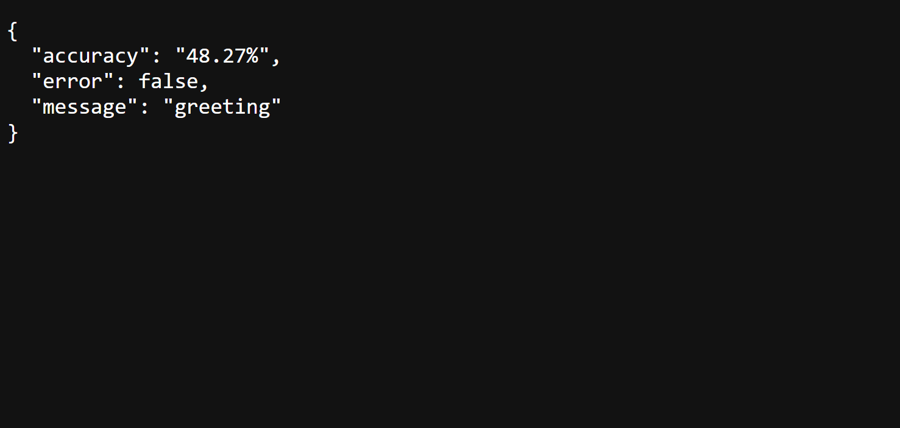

# Avexia - Web API and Machine Learning Model Classifier



This repository is code that used to train machine learning model and already containerized in web API written in Flask. The code is used to receive an audio file, specifically a chicken audio, and then response with the classifcation of the mental health condition of the animal. 

The machine learning model is made using Tensorflow to build neural network model and use librosa library that can use to preprocess audio data. 

The web API is made by Flask that can run simple web app. The web is already containerized using docker and already deployed at Google Cloud Platform.
## How to run
### Requirements:
- Python > 3.9
### Preparation
- Clone this repostiroy
- Install all requirements. From root directory, run command:
```
$ pip install -r requirements.txt
```
- Prepare the dataset:
    - From the root directory, download the dataset https://github.com/fawwazanvilen/Dataset-Vokalisasi-Ayam/archive/refs/heads/main.zip
    - Unzip it to `test/content/dataset`
    - Remove the zip
### Train Machine Learning Model
1. Open `./test`
2. Then run each of these files:
```
$ python preprocess.py
$ python train.py
```
3. After each of file runned, it will generated `test/data.json` and `test/model.h5` simulatenously. Move the `test/model.h5` to root directory. 

## Run Flask Web App
1. From the main directory, run command:
```
$ python main.py
```
2. The app will be running on localhost

## Test The Classifier At Localhost
1. Open `localhost:5000/predict`
2. You will open this page:


3. Input audio file in .wav format to test the welfare classifier and you will receive response like this:



## Deployment At Google Cloud
1. To deploy, push any changes to the `main` branch.
2. The app is hosted at https://welfare-prediction-oxcqjwbebq-et.a.run.app/predict

## Credit
This project is dedicated to Bangkit 2022 Capstone project, made by team ID C22-PC369, Avexia.

Our team member:
- (ML) M2002H0085 - Muhammad Fawwaz Abiyyu Anvilen - Institut Teknologi Bandung
- (ML) M2117G1467 - Andira Raharjo - Institut Teknologi Nasional Bandung
- (ML) M7435F3015 - Ines Nabilla - Universitas Islam Bandung
- (MD) A7434G3014 - Yusuf Aryo Wibowo - Universitas Islam As-Syafiiyah
- (CC) C2002G0087 - Kevin Rizki Mohammad - Institut Teknologi Bandung